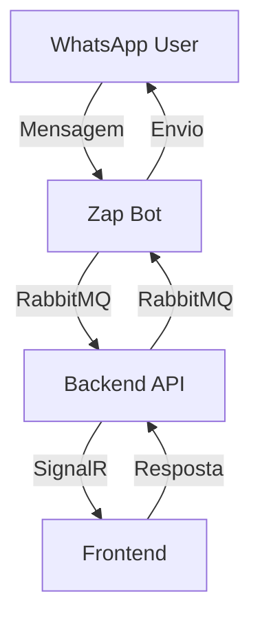
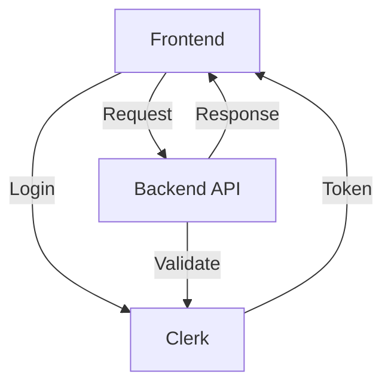
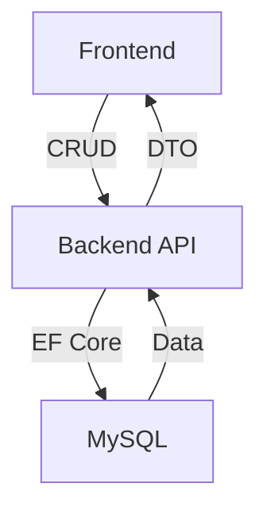

# 📊 ANÁLISE COMPLETA DA ARQUITETURA DO SISTEMA PREGIATO

## 🏗️ **VISÃO GERAL DA ARQUITETURA**

O sistema Pregiato é uma plataforma completa de gestão de talentos e CRM com integração WhatsApp, composta por **4 projetos principais**:

### **1. BACKEND API (.NET 8)**
- **Tecnologia**: ASP.NET Core 8.0, Entity Framework Core, MySQL
- **Arquitetura**: Clean Architecture (Core, Application, Infrastructure, API)
- **Banco**: MySQL (Railway) com Entity Framework Core
- **Comunicação**: SignalR para tempo real, RabbitMQ para filas

### **2. FRONTEND (React + TypeScript)**
- **Tecnologia**: React 18, TypeScript, Vite, Tailwind CSS
- **UI**: Radix UI, Shadcn/ui, Material UI
- **Estado**: Zustand, React Context API
- **Autenticação**: Clerk

### **3. ZAP BOT (Node.js)**
- **Tecnologia**: Node.js, whatsapp-web.js
- **Função**: Bot WhatsApp para envio/recebimento de mensagens
- **Comunicação**: RabbitMQ, API REST

### **4. BANCO DE DADOS (MySQL)**
- **Provedor**: Railway MySQL
- **ORM**: Entity Framework Core
- **Migrações**: Code First

---

## 🔧 **ESTRUTURA DETALHADA DOS PROJETOS**

### **BACKEND API - Estrutura de Camadas**

```
back/
├── Pregiato.API/           # Camada de Apresentação
│   ├── Controllers/        # Controllers REST
│   ├── Hubs/              # SignalR Hubs
│   ├── Services/          # Serviços da API
│   ├── Middleware/        # Middlewares customizados
│   └── Attributes/        # Atributos customizados
├── Pregiato.Application/   # Camada de Aplicação
│   ├── Services/          # Serviços de negócio
│   ├── DTOs/              # Data Transfer Objects
│   ├── Interfaces/        # Contratos de serviços
│   └── Validators/        # Validações FluentValidation
├── Pregiato.Core/         # Camada de Domínio
│   ├── Entities/          # Entidades do domínio
│   ├── Interfaces/        # Contratos de repositórios
│   └── Enums/             # Enumerações
└── Pregiato.Infrastructure/ # Camada de Infraestrutura
    ├── Data/              # DbContext e configurações
    ├── Repositories/      # Implementações dos repositórios
    └── Migrations/        # Migrações do banco
```

### **FRONTEND - Estrutura de Componentes**

```
front/src/
├── components/            # Componentes reutilizáveis
│   ├── attendance/        # Componentes de atendimento
│   ├── chat/             # Componentes de chat
│   ├── whatsapp/         # Componentes WhatsApp
│   └── ui/               # Componentes base (Shadcn)
├── pages/                # Páginas da aplicação
├── services/             # Serviços de API
├── hooks/                # Custom hooks
├── contexts/             # Contextos React
├── store/                # Estado global (Zustand)
└── types/                # Definições TypeScript
```

### **ZAP BOT - Estrutura de Módulos**

```
zap-blaster-projeto/
├── zap.js                # Arquivo principal
├── database.js           # Conexão com banco
├── resilience/           # Módulos de resiliência
│   ├── circuit-breaker.js
│   ├── retry-manager.js
│   └── resilient-sender.js
└── session/              # Sessões WhatsApp
```

---

## 🔄 **FLUXOS DE COMUNICAÇÃO**

### **1. FLUXO DE MENSAGENS WHATSAPP**



### **2. FLUXO DE AUTENTICAÇÃO**



### **3. FLUXO DE DADOS CRM**



---

## 🗄️ **MODELO DE DADOS PRINCIPAL**

### **Entidades Core do Sistema**

1. **User** - Usuários do sistema (Clerk integration)
2. **Operator** - Operadores de atendimento
3. **Lead** - Leads do CRM
4. **OperatorLeads** - Relacionamento operador-lead
5. **Conversation** - Conversas WhatsApp
6. **Message** - Mensagens unificadas
7. **ChatLog** - Logs de chat
8. **Talent** - Talentos/Modelos
9. **Contract** - Contratos
10. **AttendanceTicket** - Tickets de atendimento

### **Relacionamentos Principais**

- **User** ↔ **Operator** (1:1)
- **Operator** ↔ **OperatorLeads** (1:N)
- **Lead** ↔ **OperatorLeads** (1:N)
- **Conversation** ↔ **Message** (1:N)
- **Lead** ↔ **Contract** (1:N)
- **Talent** ↔ **Contract** (1:N)

---

## 🚀 **TECNOLOGIAS E PADRÕES**

### **Backend**
- **.NET 8** - Framework principal
- **Entity Framework Core** - ORM
- **SignalR** - Comunicação tempo real
- **RabbitMQ** - Message broker
- **Serilog** - Logging
- **AutoMapper** - Mapeamento de objetos
- **FluentValidation** - Validações

### **Frontend**
- **React 18** - Framework UI
- **TypeScript** - Tipagem estática
- **Vite** - Build tool
- **Tailwind CSS** - Styling
- **Radix UI** - Componentes base
- **Zustand** - Estado global
- **Axios** - HTTP client
- **SignalR Client** - Tempo real

### **Zap Bot**
- **Node.js** - Runtime
- **whatsapp-web.js** - WhatsApp API
- **amqplib** - RabbitMQ client
- **Express** - HTTP server
- **MySQL2** - Database driver

### **Infraestrutura**
- **MySQL** - Banco de dados
- **RabbitMQ** - Message broker
- **Railway** - Hosting
- **Docker** - Containerização

---

## 🔐 **SEGURANÇA E AUTENTICAÇÃO**

### **Autenticação**
- **Clerk** - Provider de autenticação
- **JWT Tokens** - Tokens de acesso
- **Middleware customizado** - Validação de tokens

### **Autorização**
- **Roles** - Sistema de papéis
- **Attributes** - Autorização por atributos
- **Middleware** - Validação de permissões

---

## 📡 **COMUNICAÇÃO ENTRE SERVIÇOS**

### **API REST**
- **Base URL**: `http://localhost:5656/api`
- **Endpoints principais**:
  - `/chats` - Gestão de chats
  - `/operator-leads` - Gestão de leads
  - `/users` - Gestão de usuários
  - `/talents` - Gestão de talentos

### **SignalR Hubs**
- **WhatsAppHub** - Eventos WhatsApp
- **Eventos**: `message.inbound`, `message.outbound`, `chat.updated`

### **RabbitMQ**
- **Filas principais**:
  - `whatsapp.messages` - Mensagens WhatsApp
  - `whatsapp.status` - Status de mensagens
  - `whatsapp.qr` - QR codes

---

## 🎯 **FUNCIONALIDADES PRINCIPAIS**

### **1. Sistema de Atendimento**
- Chat em tempo real
- Gestão de tickets
- Atribuição de operadores
- Histórico de conversas

### **2. CRM de Leads**
- Gestão de leads
- Rastreamento de contatos
- Agendamento de seletivas
- Relatórios de progresso

### **3. Gestão de Talentos**
- Cadastro de talentos
- Contratos
- DNA físico
- Documentação

### **4. Integração WhatsApp**
- Envio/recebimento de mensagens
- Mídia (imagens, áudios, documentos)
- Status de entrega
- QR code para autenticação

---

## 🔧 **CONFIGURAÇÃO E DEPLOY**

### **Variáveis de Ambiente**

**Backend**:
- `ConnectionStrings__DefaultConnection` - MySQL
- `RabbitMQ__Host` - RabbitMQ host
- `Clerk__SecretKey` - Clerk secret

**Frontend**:
- `VITE_CLERK_PUBLISHABLE_KEY` - Clerk public key
- `VITE_API_BASE_URL` - API base URL

**Zap Bot**:
- `API_BASE` - Backend API URL
- `INSTANCE_ID` - ID da instância
- `RABBITMQ_URL` - RabbitMQ connection

### **Scripts de Desenvolvimento**

**Backend**:
```bash
dotnet run --project Pregiato.API
```

**Frontend**:
```bash
npm run dev
```

**Zap Bot**:
```bash
npm run dev
```

---

## 📈 **MÉTRICAS E MONITORAMENTO**

### **Logging**
- **Serilog** - Backend logging
- **Console logs** - Frontend debugging
- **File logs** - Zap bot logging

### **Health Checks**
- **API Health** - `/health` endpoint
- **RabbitMQ Status** - Connection monitoring
- **Database Status** - EF Core health

---

## 🚨 **PONTOS DE ATENÇÃO**

### **Performance**
- **Deduplicação de chats** - Implementada
- **Cache de mensagens** - Em desenvolvimento
- **Batch processing** - RabbitMQ

### **Resiliência**
- **Circuit breaker** - Zap bot
- **Retry policies** - API calls
- **Dead letter queues** - RabbitMQ

### **Segurança**
- **CORS** - Configurado
- **Rate limiting** - Não implementado
- **Input validation** - FluentValidation

---

## 🔮 **ROADMAP E MELHORIAS**

### **Curto Prazo**
- [ ] Implementar rate limiting
- [ ] Melhorar cache de mensagens
- [ ] Adicionar testes unitários

### **Médio Prazo**
- [ ] Implementar microserviços
- [ ] Adicionar monitoramento (Prometheus)
- [ ] Melhorar resiliência

### **Longo Prazo**
- [ ] Migração para Kubernetes
- [ ] Implementar CI/CD
- [ ] Adicionar analytics avançados

---

*Esta análise foi gerada em: 2025-01-05*
*Versão do sistema: 1.0.0*
