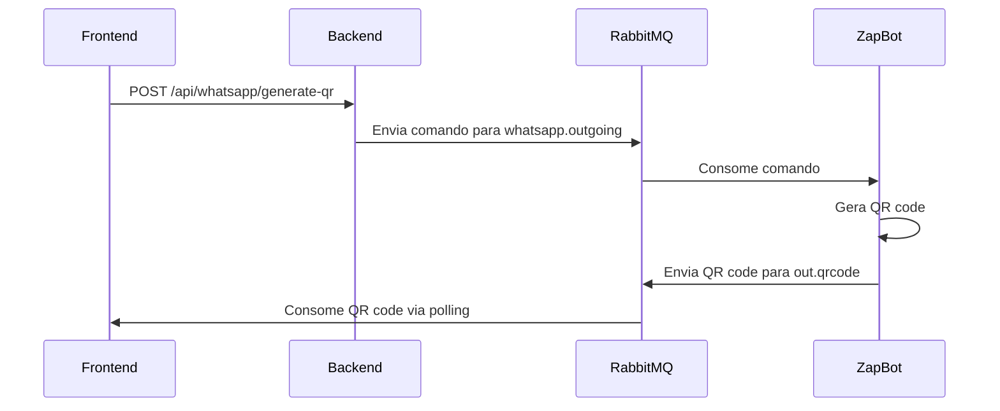
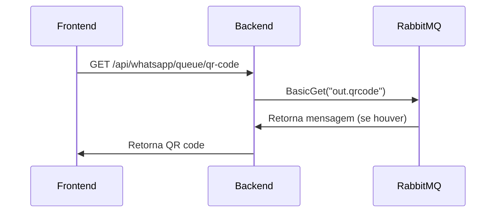

# Sistema de Fila de QR Code

## Visão Geral

Este documento descreve o novo sistema implementado para recebimento de QR codes via fila RabbitMQ, substituindo o processo anterior de polling.

## Arquitetura

### Componentes

1. **Zap-Bot** (`zap-blaster-projeto/zap.js`)
   - Gera QR codes quando necessário
   - Envia QR codes para a fila `out.qrcode` do RabbitMQ
   - Mantém compatibilidade com o sistema anterior (API)

2. **Backend** (`Pregiato.API/Controllers/WhatsAppController.cs`)
   - Declara a fila `out.qrcode` no RabbitMQ
   - Fornece endpoint `/api/whatsapp/queue/qr-code` para consumir a fila
   - Processa mensagens da fila e retorna o QR code

3. **Frontend** (`front/src/`)
   - `qr-code-queue-service.ts`: Serviço para consumir a fila
   - `useWhatsAppConnection.ts`: Hook atualizado para usar a fila
   - Componentes de UI mantêm a mesma interface

## Fluxo de Funcionamento

### 1. Geração de QR Code



### 2. Consumo da Fila



## Implementação

### Zap-Bot (zap.js)

```javascript
// Declaração da fila
const qrCodeQueue = 'out.qrcode';
await channel.assertQueue(qrCodeQueue, { durable: true });

// Envio do QR code para a fila
const qrCodeMessage = {
  qrCode: qrBase64,
  timestamp: new Date().toISOString(),
  instanceId: instanceId,
  type: 'qr_code'
};

await global.rabbitChannel.sendToQueue(qrCodeQueue, messageBuffer, {
  persistent: true,
  contentType: 'application/json'
});
```

### Backend (WhatsAppController.cs)

```csharp
// Declaração da fila
_rabbitChannel.QueueDeclare("out.qrcode", durable: true, exclusive: false, autoDelete: false);

// Endpoint para consumir a fila
[HttpGet("queue/qr-code")]
public async Task<IActionResult> GetQRCodeFromQueue()
{
    var result = _rabbitChannel.BasicGet("out.qrcode", false);
    if (result == null)
        return NotFound(new { message = "Nenhum QR code disponível na fila" });
    
    // Processa e retorna o QR code
}
```

### Frontend (qr-code-queue-service.ts)

```typescript
class QRCodeQueueService {
  async startQRCodeConsumer() {
    const consumeMessages = async () => {
      const response = await axios.get('http://localhost:5656/api/whatsapp/queue/qr-code');
      if (response.data && response.data.qrCode) {
        this.handlers.forEach(handler => handler(response.data.qrCode));
      }
    };
    
    this.consumeInterval = setInterval(consumeMessages, 2000);
  }
}
```

## Vantagens do Novo Sistema

1. **Eficiência**: Elimina polling desnecessário
2. **Responsividade**: QR codes são recebidos imediatamente quando disponíveis
3. **Escalabilidade**: Sistema baseado em filas é mais robusto
4. **Compatibilidade**: Mantém compatibilidade com sistema anterior
5. **Confiabilidade**: Mensagens persistentes garantem entrega

## Configuração

### Variáveis de Ambiente

```bash
# RabbitMQ
RABBITMQ_HOST=mouse.rmq5.cloudamqp.com
RABBITMQ_USER=ewxcrhtv
RABBITMQ_PASS=DNcdH0NEeP4Fsgo2_w-vd47CqjelFk_S
RABBITMQ_VHOST=ewxcrhtv

# API
API_URL=http://localhost:5656
```

### Filas RabbitMQ

- `whatsapp.outgoing`: Comandos para o zap-bot
- `out.qrcode`: QR codes gerados pelo zap-bot
- `whatsapp.incoming`: Mensagens recebidas
- `chat.assign`: Atribuições de chat
- `notification.agent`: Notificações para agentes
- `report.update`: Atualizações de relatórios

## Monitoramento

### Logs Importantes

```bash
# Zap-Bot
📨 QR enviado para fila RabbitMQ: out.qrcode

# Backend
QR code obtido da fila - Tamanho: 12345

# Frontend
📱 QR Code recebido da fila: data:image/png;base64,iVBORw0KGgoAAAANSUhEUgAA...
```

### Métricas

- Tempo de entrega do QR code
- Taxa de sucesso na geração
- Latência da fila
- Número de tentativas

## Troubleshooting

### Problemas Comuns

1. **QR code não aparece**
   - Verificar se a fila `out.qrcode` foi declarada
   - Verificar logs do zap-bot
   - Verificar conexão RabbitMQ

2. **Erro de timeout**
   - Verificar se o zap-bot está rodando
   - Verificar se o backend está acessível
   - Verificar configurações de rede

3. **QR code corrompido**
   - Verificar encoding base64
   - Verificar tamanho da mensagem
   - Verificar logs de erro

### Comandos de Debug

```bash
# Verificar status do zap-bot
curl http://localhost:3030/status

# Verificar filas RabbitMQ
curl http://localhost:5656/api/whatsapp/queue/metrics

# Testar geração de QR code
curl -X POST http://localhost:5656/api/whatsapp/generate-qr
```

## Migração

O sistema foi implementado de forma que mantém compatibilidade com o sistema anterior. A migração é automática e transparente para o usuário final.

### Rollback

Para voltar ao sistema anterior, basta:
1. Remover o listener da fila no frontend
2. Reativar o polling no hook `useWhatsAppConnection`
3. Manter apenas o endpoint de API para QR code
